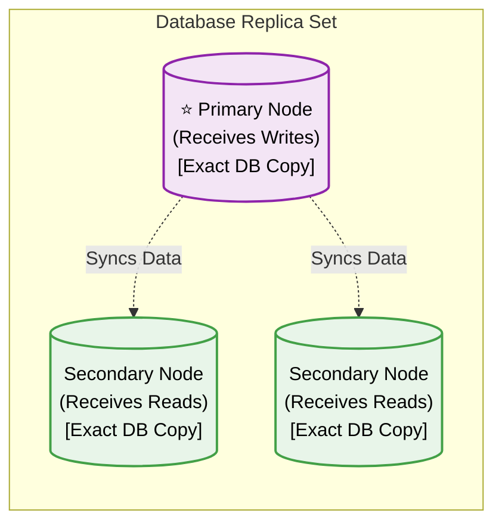
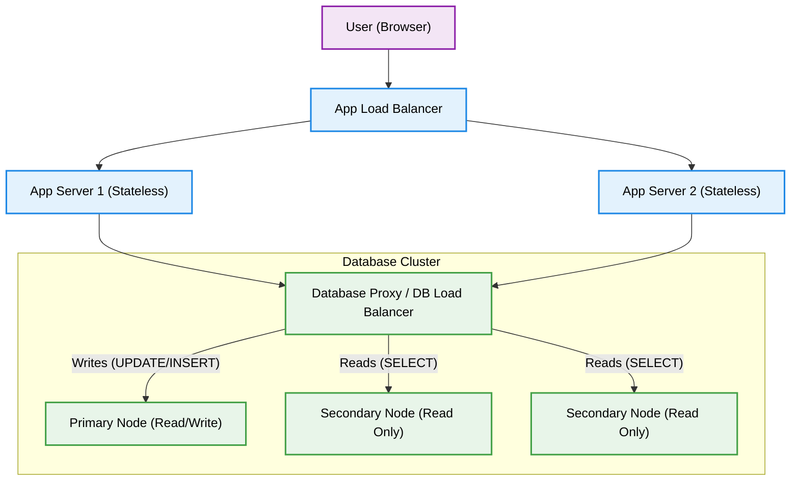
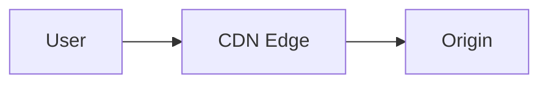

# DBMS Architecture: Clustering, Replica Sets & CDNs

Hello there! Welcome back to the classroom. Today we are exploring the absolute bedrock of modern, large-scale distributed systems. 

Imagine a single database server acting like a solo librarian. If one person asks for a book, they can handle it. But if a million people ask at once, or if the librarian gets sick, the whole system collapses. This is the **Single Point of Failure (SPOF)** and the bottleneck that clustering, replica sets, and CDNs solve.

By the end of this masterclass, you will understand exactly how modern databases distribute massive workloads, keep data perfectly synced across the globe, handle simultaneous user conflicts, and deliver content at the speed of light.

---

## ⭐ Part 1: The Basics (Clusters vs. Replica Sets) [Basic Interview Focus]
While the terms are often used interchangeably, they have distinct roles in system design.

> [!NOTE]
> **What is a Node?**
> A "node" is just a single server. In the modern cloud, it is usually a Virtual Machine or a Container with its own dedicated CPU, memory, and storage, running a single instance of the database software.

### 1. Database Cluster
A Database Cluster is a group of interconnected servers (nodes) that act as a single system. Users connect to the cluster thinking it's one giant machine, but behind the scenes, multiple servers are working together.

### 2. Replica Set
A Replica Set is a specific type of cluster where multiple nodes hold the exact same copy of your data. Its primary job is **High Availability**. If one server crashes, another immediately takes its place.

In a standard replica set, nodes are given specific roles:
* **Primary Node (Leader/Master):** The boss. It is usually the only node allowed to accept new data or changes (Writes).
* **Secondary Nodes (Followers/Slaves):** These nodes maintain a strict copy of the Primary's data. They handle read requests (like "show me my profile") but cannot accept writes.

## ⭐ Part 2: The Load Balancer & The Traffic Cops [Basic Interview Focus]
If you have five servers in a cluster, how does a user's phone know which one to talk to? It doesn't. The traffic is managed by routing layers.

It's critical to understand the separation between the Application Tier and the Database Tier.

> [!IMPORTANT]
> **Stateless vs. Stateful**
> * **Application Servers (Backend)** are **Stateless**. They run logic (Node.js, Python), calculate results, and forget them. You can spin up 100 identical App Servers and they don't need to sync with each other.
> * **Database Servers** are **Stateful**. They are the permanent memory. Clustering them requires complex replication and synchronization protocols.

### How Traffic is Routed

1. **The App Load Balancer:** Sits at the edge of the backend network and distributes incoming user HTTP requests across the stateless Application Servers.
2. **The Database Routing (Two Methods):**
   * **Method A (Smart Database Driver):** The Application Server code uses an internal driver that maintains two separate connection pools: one specifically pointing to the Primary node for Writes, and one pointing to a DB Load Balancer for Reads.

   * **Method B (Smart Database Proxy):** The App Server just sends all queries to a single endpoint: a **Database Proxy** (like ProxySQL). The proxy sits in front of the database cluster, parses the SQL in real-time, and automatically routes `UPDATE`/`INSERT` commands to the Primary and `SELECT` commands to the Secondaries.

## Part 3: Keeping Data Synced (Replication)
When the Primary node receives a new piece of data, it must inform the Secondary nodes. Every action the Primary takes is written to a **Write-Ahead Log (WAL)** or Oplog. The Secondary nodes constantly read this log and apply the exact same actions to their own data.

This sync happens in one of two ways:

### 1. Synchronous Replication (Maximum Safety)
The Primary gets the data, sends it to the Secondaries, and **waits** for them to say "Got it!" before telling the user "Success."
* **Pros:** Zero data loss. Everyone is always perfectly in sync.
* **Cons:** Slow. If a Secondary server is lagging or offline, the user has to wait.

### 2. Asynchronous Replication (Maximum Speed)
The Primary gets the data, immediately tells the user "Success!", and then sends the update to the Secondaries in the background.
* **Pros:** Lightning fast.
* **Cons:** Replication Lag. For a few milliseconds, the Secondaries are out of date (serving stale data).

## Part 4: Solving the "Stale Read" Problem
In asynchronous replication, if you update your profile picture (Write to Primary) and immediately refresh the page (Read from Secondary), you might see your old picture because the Secondary hasn't synced yet. 

To fix this, systems use **Read-After-Write Consistency**. The system "remembers" that you just made an edit and actively routes your subsequent reads to the Primary node for a few seconds.

### How is the Session ID Stored Efficiently?
Systems use a blazing fast in-memory cache like **Redis**.

> [!TIP]
> **The Redis TTL Trick:** 
> Redis uses a flat Key-Value structure with a Time-To-Live (TTL), making the lookup O(1) regardless of millions of users. 

**The Exact Flow:**
1. **The Write:** You update your profile. The App Server executes the write on the Primary database.
2. **The Cache Insert:** The App Server immediately sends a command to Redis: `SET user_123_write_flag TRUE EX 5`. The `EX 5` tells Redis to delete this key after exactly 5 seconds.
3. **The Read:** You refresh the page. The App Server asks Redis: `GET user_123_write_flag`.
4. **The Route:**
   * If Redis returns `TRUE` (within 5 seconds), the App Server routes your read strictly to the Primary Node. You see your updated data.
   * If Redis returns `NULL` (after 5 seconds), the App Server confidently routes your read to the Secondary Node.

*Flowchart placeholder*

> [!IMPORTANT]
> Alternatively, a **Smart Database Proxy** can do this entirely on its own by intercepting the SQL, logging recently modified User IDs in its own memory, and overriding its load-balancing rules for those IDs for a few seconds.

## Part 5: Multi-Primary Clusters & Conflict Resolution
In massive global systems (like Amazon or Google), relying on a single Primary node is too slow. They use a **Multi-Primary (Active-Active)** setup where multiple servers can accept writes simultaneously.

But what if a user in India and a user in the US update the exact same data simultaneously on two different Primary nodes?

### 1. Relative Writes vs Absolute Writes
Last write wins is bad. Use CRDTs.
### 2. Vector Clocks
Use vector clocks to track history.
### 3. Fallbacks
Prompt the user.

## Part 6: Coordinators & Distributed Deadlocks
To prevent conflicts on absolutely critical data (like booking a flight seat), databases use **Distributed Locks**. But if Node A locks and asks B, and Node B locks and asks A, you get a **Distributed Deadlock** and the system freezes.

> [!WARNING]
> **Quorums:** Databases never wait for *all* nodes to agree (too slow). They only need a strict majority (e.g., 3 out of 5). This is called a Quorum.

### Breaking the Tie
There are two ways to break a distributed deadlock:

**Method 1: The Consensus Coordinator (ZooKeeper / etcd)**
Enterprise systems use a specialized micro-cluster (the Coordinator) as the single referee. 
* It uses an **Odd Number Rule** (3, 5, or 7 nodes) to ensure a majority vote and prevent "split-brain" scenarios.
* Nodes ask the Coordinator to create a lock file (`CREATE FILE: /locks/User_123`).
* Because the Coordinator executes atomically, it is physically impossible for two nodes to create the file simultaneously. The first one gets the lock; the second gets a "File exists" error and must wait.
* **Ephemeral Keys (Leases):** The lock is tied to a heartbeat. If the node holding the lock dies, the Coordinator deletes the lock after a few seconds so the system doesn't freeze permanently.

**Method 2: Timestamp Tie-Breakers (Peer-to-Peer)**
Nodes stamp transactions with precise timestamps. If a deadlock occurs, algorithms like **Wait-Die** kick in:
* If an *older* transaction needs a lock held by a *younger* one, it is allowed to wait.
* If a *younger* transaction needs a lock held by an *older* one, the younger one must die (abort and retry).

## Part 7: The Global Edge (Content Delivery Networks)
CDNs solve the one problem your database cluster cannot fix: the speed of light. 

A CDN is a globally distributed network of massive cache servers (Edge Nodes / PoPs) located geographically close to the users.

### The Request Flow (Dynamic vs Static)

The secret to CDNs is that they do not cache everything. They strictly separate **Dynamic API Data** from **Static Assets**.

When a user asks for a file, it checks the CDN. If it's a hit, it serves. If miss, it fetches from origin.

> [!IMPORTANT]
> By offloading 90% of the heavy static traffic (images, videos, CSS) to the CDN, your Origin Database is protected from crashing during massive traffic spikes.

### Cache Invalidation (Handling Stale Assets)
If you update a logo, how do you force the CDN to drop the old one?
1. **Time-To-Live (TTL):** The asset expires automatically after X hours.
2. **Cache Purging:** You send an API command to the CDN to manually delete the specific file across the globe.
3. **Versioning (Cache-Busting) [Best Practice]:** Never overwrite a file. Upload the new logo as `logo_v2.png` and update your database/HTML to point to the new filename. The CDN has never seen `v2`, so it is forced to fetch the fresh copy. The old `v1` simply rots away in the cache until its TTL expires.

## Appendix: One-Line Definitions to Remember
| Term | Definition |
| :--- | :--- |
| **Cluster** | Interconnected servers acting as a single system. |
| **Replica Set** | A cluster specifically holding identical copies of data for High Availability. |
| **Primary Node** | The master node that accepts write operations. |
| **Secondary Node** | A read-only node that asynchronously synchronizes with the Primary. |
| **Load Balancer** | A router that distributes traffic to prevent overwhelming a single server. |
| **Database Proxy** | A smart load balancer specifically for SQL queries. |
| **Write-Ahead Log (WAL)** | The log of changes the Primary sends to Secondaries to keep them synced. |
| **Vector Clock** | An array tracking version history to detect simultaneous edit conflicts. |
| **CRDT** | A data structure that mathematically resolves merge conflicts automatically. |
| **Coordinator (ZooKeeper)** | A specialized micro-cluster that issues locks to prevent deadlocks. |
| **Quorum** | A strict majority vote required for a distributed system to make a decision. |
| **CDN (Edge Node)** | A global network of cache servers physically close to users. |
| **Origin Server** | Your actual backend and database servers acting as the single source of truth. |
| **Cache Busting** | Forcing a CDN to fetch fresh data by changing the filename (versioning). |
