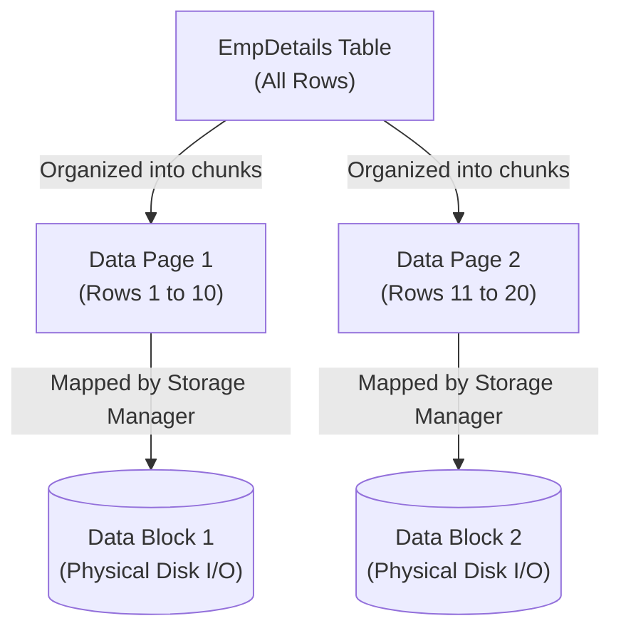
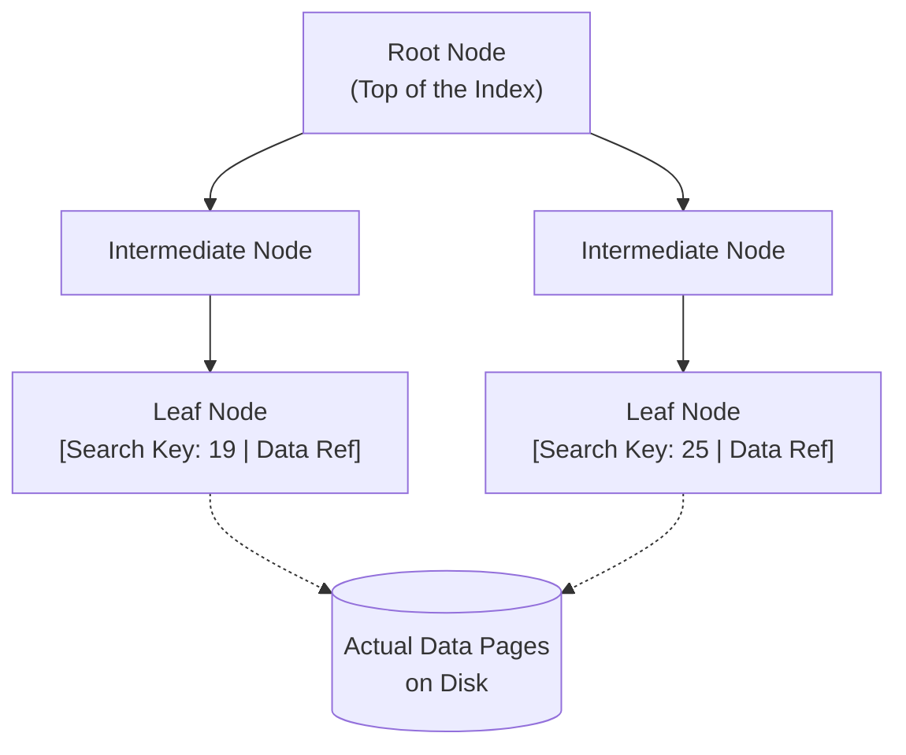

# DBMS Indexing: The Deep Masterclass

Hello there! Imagine we are sitting in a classroom. Today, we are going deeper than surface-level definitions. We are going to build a complete mental model of how a Database Management System (DBMS) stores, manages, and finds data using Indexes and B+ Trees.

By the end of this, you will understand not just the *what*, but the exact *how* and *why*, clearing up every small confusion in all directions.

---

## Part 1: How is Data Actually Stored?

Before we talk about indexing, we must understand the physical reality of your data. 

Suppose we have this simple table:
**EmpDetails:**
| EmpId | EmpName |
|-------|---------|
| 19    | A       |
| 25    | B       |
| 30    | C       |
| 17    | D       |
| 6     | E       |

The database does **not** think of this entire table as one giant object. Instead, it organizes the data into fixed-size units.

### 1. The Data Page (The Logical Container)
A **Data Page** is a fixed-size unit (often around 8 KB) in which database records are actually stored. 

If you could look inside one of these Data Pages, you wouldn't just see raw text. You would see three conceptual parts:
1. **Header:** Contains metadata (like the page number and how much free space is left).
2. **Data Records:** The actual rows of your table.
3. **Offset / Slot Info:** A directory at the end of the page that helps the database instantly locate individual records within that specific page.

### 2. Data Page vs. Data Block (And The Storage Manager)
Here is a major gap that most tutorials completely skip: *Who is managing these pages?*

There are two different worlds:
* **Data Page:** This is the *database's* logical storage unit. This is how the DBMS structures and thinks about data.
* **Data Block:** This is the underlying *physical storage unit* used for physical I/O on your persistent storage (Disk).

Who connects them? **The Storage Manager.**
The Storage Manager is a core component of the DBMS. Its entire job is to handle the mapping between the logical Data Pages and their persistent physical locations (Data Blocks) on the disk.

*(Note: Do not memorize a universal rule like "8 KB page = exactly one physical disk block". The exact implementation differs between database systems, but the Storage Manager always handles this translation).*

### 3. The Nightmare: A Full Table Scan
Imagine a table with 1,000,000 rows. You run:
`SELECT * FROM EmpDetails WHERE EmpId = 500000;`

Without a suitable index, the DBMS asks the Storage Manager to fetch Data Page 1, search it, then Data Page 2, search it, then Data Page 3... 
Searching page after page requires massive physical Disk I/O, which is incredibly expensive. This is the problem we must solve.

---

## Part 2: The Solution (The Index)

To avoid scanning every Data Page, we create an **Index**. 

Indexing means creating an additional structure that helps the DBMS find data faster. Instead of scanning many pages, the flow becomes:
`Query` ➔ `Index` ➔ `Find required location quickly` ➔ `Actual Data`

### What is inside an Index?
At the bottom of an index, you have entries made of two things:
1. **Search Key:** What you are looking for (e.g., `EmpId = 19`).
2. **Data Reference:** A reference that tells the DBMS exactly where the corresponding actual table data can be found. 

**What exactly is a Data Reference?**
It is not just a vague pointer. It is conceptually a combination like `(Data Page Number, Slot Number)`. It tells the Storage Manager: "Go fetch Data Page 1, and look at Slot 3 for this exact record."

### The Concept vs. The Implementation
It is extremely important to remember: **An Index is just a conceptual idea.** The actual physical data structure used to implement this concept in almost all relational databases is the **B+ Tree**.

Here is what the entire B+ Tree index structure looks like:

---

