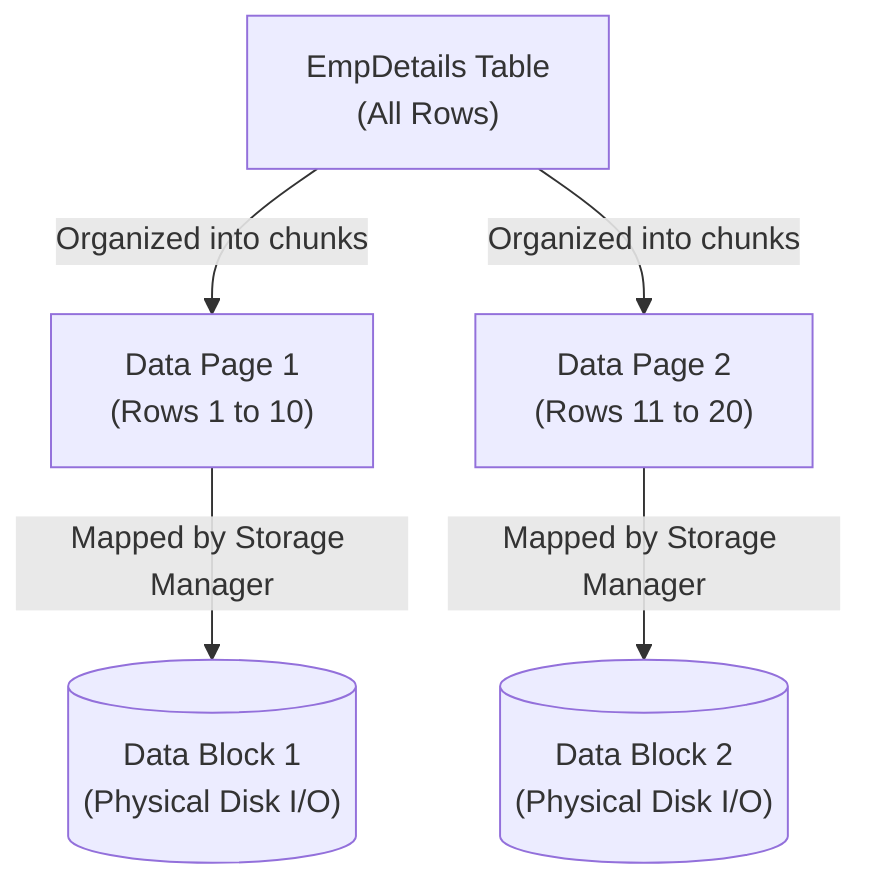
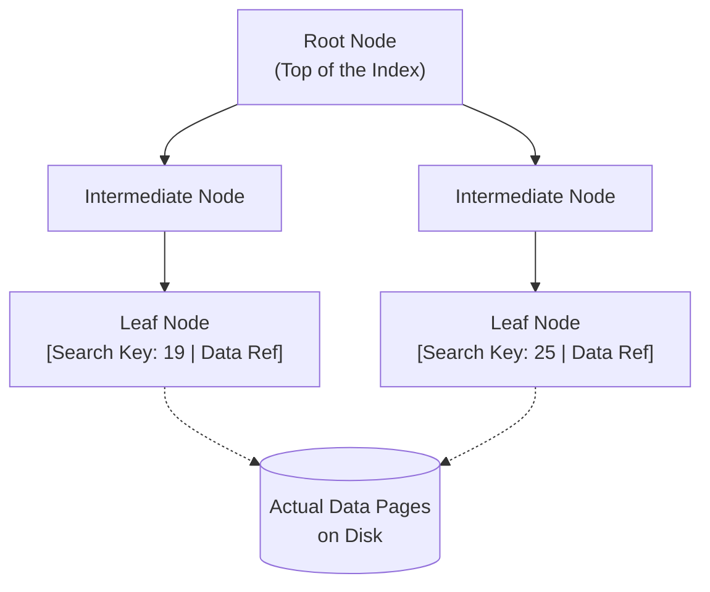
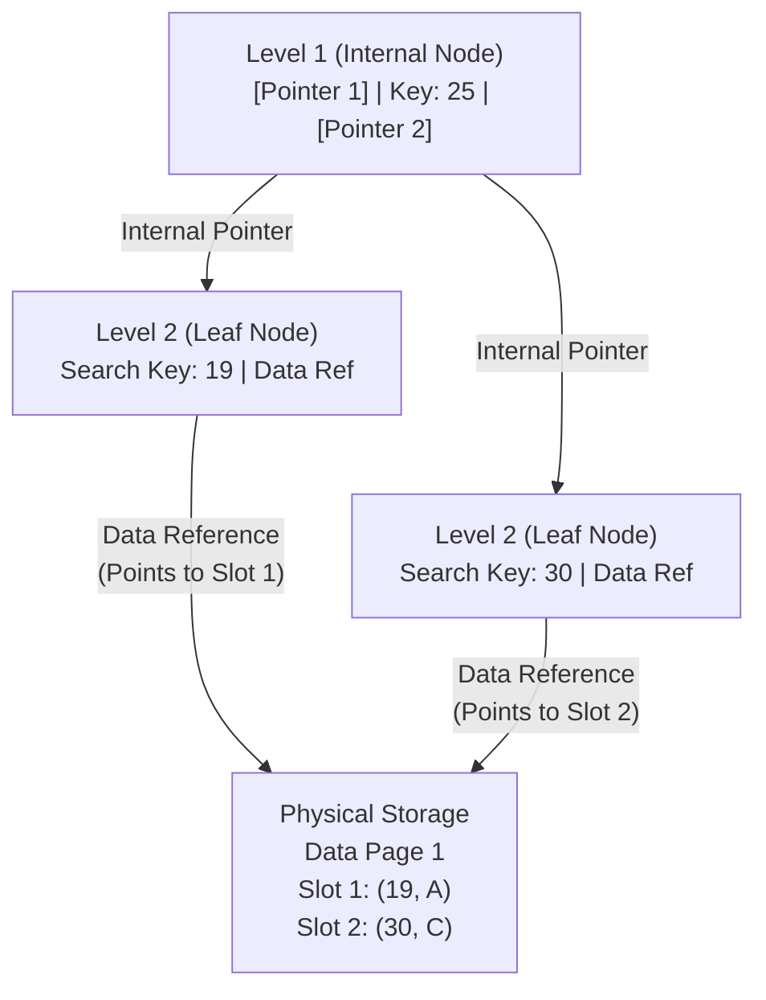
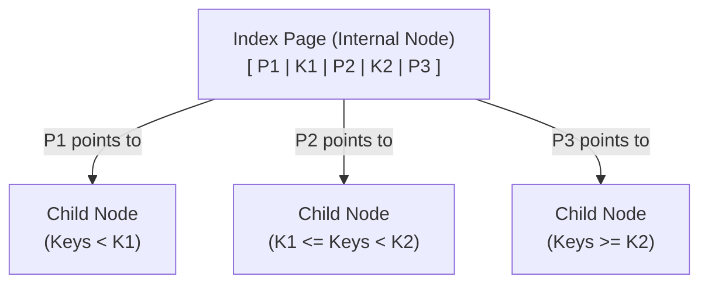
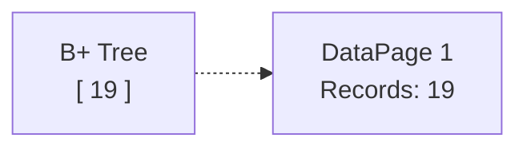
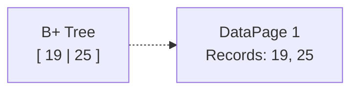
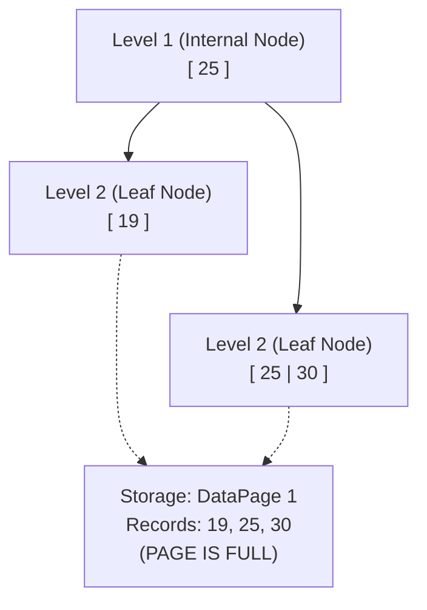
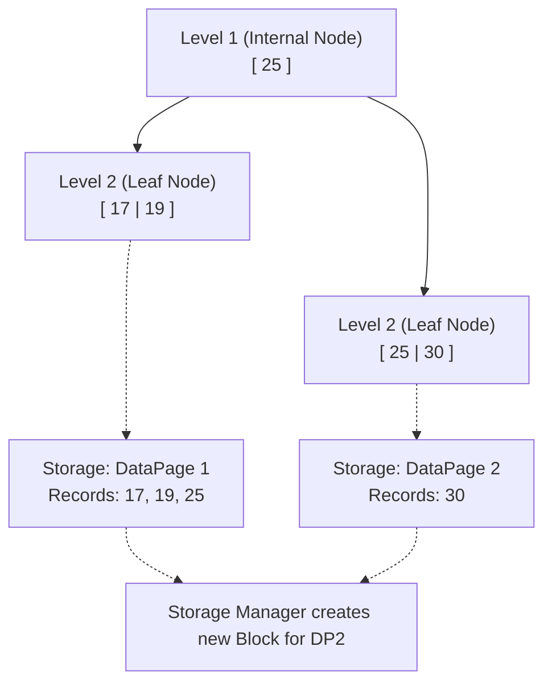
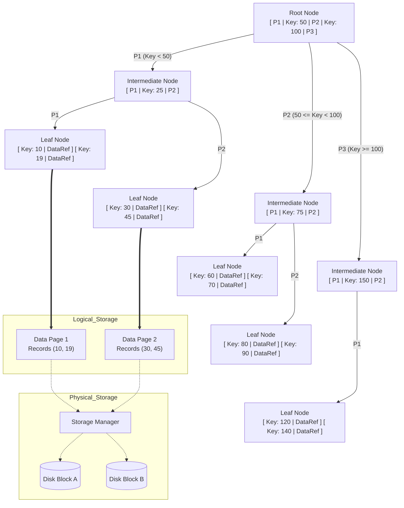

# DBMS Indexing: The Deep Masterclass

Hello there! Imagine we are sitting in a classroom. Today, we are going deeper than surface-level definitions. We are going to build a complete mental model of how a Database Management System (DBMS) stores, manages, and finds data using Indexes and B+ Trees.

By the end of this, you will understand not just the *what*, but the exact *how* and *why*, clearing up every small confusion in all directions.

---

## Part 1: How is Data Actually Stored?

Before we talk about indexing, we must understand the physical reality of your data. 

Suppose we have this simple table:
**EmpDetails:**
| EmpId | EmpName |
|-------|---------|
| 19    | A       |
| 25    | B       |
| 30    | C       |
| 17    | D       |
| 6     | E       |

The database does **not** think of this entire table as one giant object. Instead, it organizes the data into fixed-size units.

### 1. The Data Page (The Logical Container)
A **Data Page** is a fixed-size unit (often around 8 KB) in which database records are actually stored. 

If you could look inside one of these Data Pages, you wouldn't just see raw text. You would see three conceptual parts:
1. **Header:** Contains metadata (like the page number and how much free space is left).
2. **Data Records:** The actual rows of your table.
3. **Offset / Slot Info:** A directory at the end of the page that helps the database instantly locate individual records within that specific page.

### 2. Data Page vs. Data Block (And The Storage Manager)
Here is a major gap that most tutorials completely skip: *Who is managing these pages?*

There are two different worlds:
* **Data Page:** This is the *database's* logical storage unit. This is how the DBMS structures and thinks about data.
* **Data Block:** This is the underlying *physical storage unit* used for physical I/O on your persistent storage (Disk).

Who connects them? **The Storage Manager.**
The Storage Manager is a core component of the DBMS. Its entire job is to handle the mapping between the logical Data Pages and their persistent physical locations (Data Blocks) on the disk.

*(Note: Do not memorize a universal rule like "8 KB page = exactly one physical disk block". The exact implementation differs between database systems, but the Storage Manager always handles this translation).*

### 3. The Nightmare: A Full Table Scan
Imagine a table with 1,000,000 rows. You run:
`SELECT * FROM EmpDetails WHERE EmpId = 500000;`

Without a suitable index, the DBMS asks the Storage Manager to fetch Data Page 1, search it, then Data Page 2, search it, then Data Page 3... 
Searching page after page requires massive physical Disk I/O, which is incredibly expensive. This is the problem we must solve.

---

## Part 2: The Solution (The Index)

To avoid scanning every Data Page, we create an **Index**. 

Indexing means creating an additional structure that helps the DBMS find data faster. Instead of scanning many pages, the flow becomes:
`Query` ➔ `Index` ➔ `Find required location quickly` ➔ `Actual Data`

### What is inside an Index?
At the bottom of an index, you have entries made of two things:
1. **Search Key:** What you are looking for (e.g., `EmpId = 19`).
2. **Data Reference:** A reference that tells the DBMS exactly where the corresponding actual table data can be found. 

**What exactly is a Data Reference?**
It is not just a vague pointer. It is conceptually a combination like `(Data Page Number, Slot Number)`. It tells the Storage Manager: "Go fetch Data Page 1, and look at Slot 3 for this exact record."

### The Concept vs. The Implementation
It is extremely important to remember: **An Index is just a conceptual idea.** The actual physical data structure used to implement this concept in almost all relational databases is the **B+ Tree**.

Here is what the entire B+ Tree index structure looks like:

---

## Part 3: The Gap (Why exactly do we use a B+ Tree?)

If you have millions of rows, your index will have millions of entries (especially if it is a Dense Index). 

If we just saved all these index entries in a simple, flat file (a single-level linear list), the index itself would span thousands of pages. 

> **🙋 Student Question:** *Wait, if the index file is sorted, why can't the database just use Binary Search on the flat file?*
> 
> **👨‍🏫 Teacher's Answer:** That is a brilliant question! Binary search is incredibly fast when data is entirely in your computer's RAM. But remember, this massive index file lives on the slow **Disk**. 
> If you do binary search across 1,000 Index Pages, the DBMS has to fetch Page 500 from the disk, then fetch Page 250, then fetch Page 375... Every "jump" requires a painfully slow physical Disk I/O read. 
> 
> **🙋 Student Follow-up:** *But wait... in a B+ tree, we still have to fetch the Root Page, then the Intermediate Page, then the Leaf Page from the disk. That is still multiple disk reads! What is the difference?*
> 
> **👨‍🏫 Teacher's Answer:** It comes down to the math. It's true both require disk reads, but let's look at *how many*. 
> Imagine one 8KB Index Page can hold 500 pointers. 
> - The Root page holds 500 pointers.
> - The Intermediate level holds 500 × 500 = 250,000 pointers.
> - The Leaf level holds 500 × 250,000 = **125,000,000** records.
> To find one record out of 125 million using a B+ Tree, you only need **3 disk reads** (Root ➔ Intermediate ➔ Leaf). 
> If you used Binary Search on a flat file of 125 million records, you would need `log2(125,000,000)` = **27 disk reads**. 
> Furthermore, databases are smart: they keep the Root and Intermediate pages cached in the fast RAM because they are used for almost every query. So in reality, searching a 125-million row B+ Tree often requires only **1** actual physical disk read (fetching the leaf)!

To organize this massive list so it can be searched with the absolute minimum number of disk reads, we break it down into multiple levels (a Multi-Level Index) using the **B+ Tree** shown above.
Why a B+ Tree?
* The tree remains perfectly balanced.
* Millions of values only result in a tree a few levels deep.
* Insertions, deletions, and searches are extremely efficient (logarithmic time).

### The Most Important Distinction (Do Not Confuse These!)
A B+ Tree has two types of nodes. You *must* understand what their pointers do. This is the distinction that usually causes confusion:

1. **INTERNAL NODE POINTERS ➔ Point to another INDEX PAGE / B+ Tree Node.**
   * Internal nodes are just guideposts (e.g., "If Key < 25, go left"). They do not point to your table data.
2. **LEAF NODE DATA REFERENCES ➔ Point to the ACTUAL DATA RECORD.**
   * Leaves hold the `(Page Number, Slot Number)` that tells the Storage Manager where to fetch the actual table row.

Here is a visual breakdown showing exactly how these two types of pointers behave differently:

### Where are the B+ Tree Nodes stored?
A B+ Tree is huge, so it cannot be stored as one single physical object. It must also be saved to the disk. 
Just like table data is stored in *Data Pages*, the nodes of the B+ Tree are stored in **Index Pages**.

* Root Node ➔ Stored in Index Page 1
* Internal Node ➔ Stored in Index Page 2
* Leaf Node ➔ Stored in Index Page 3

To visualize exactly what one of these internal nodes looks like when saved inside an Index Page, think of it as an alternating array of Pointers (P) and Keys (K):

**Rule of Thumb:**
* **Index Pages** store the B+ Tree information.
* **Data Pages** store the actual table records.

---

## Part 4: Step-by-Step Insertion 
*(See [this video](INSERT_VIDEO_LINK_HERE) for more clarity on this specific example)*

Let's watch both the B+ Tree and the Data Pages react as we insert our data: `19, 25, 30, 17, 6`.
Assume our B+ Tree has an **Order of 3**, meaning the **Maximum Keys per node is 2**.

### Step 1: Insert 19
* **B+ Tree:** A root node is created containing `[19]`.
* **Storage:** The record is assigned to `DataPage1`. The Storage Manager maps `DataPage1` to `DataBlock1`.

### Step 2: Insert 25
* **B+ Tree:** The root node has space (max keys is 2), so it becomes `[19, 25]`.
* **Storage:** Both records can currently fit in the same data page in this example. `DataPage1` holds both.

### Step 3: Insert 30 (The B+ Tree Split!)
* **B+ Tree:** We try to insert 30, making the node `[19, 25, 30]`. But our maximum is 2! The node overflows and must **split**. 
  * *How the split happens:* We pick the middle number (`25`) and push it *up* to create a new Parent node (a guidepost). 
  * The number smaller than 25 (`19`) stays in the Left Leaf. 
  * The numbers 25 and greater (`25, 30`) go to the Right Leaf.
* **Storage:** The record `30` is added to `DataPage1`, making `DataPage1` **completely full** in our storage example.

### Step 4: Insert 17 (The Data Page Split!)
We want to insert `17`. 
* **B+ Tree Route:** Because `17 < 25`, the B+ tree routes us to the left side.
* **The Storage Problem:** The DBMS checks the neighboring data location and finds that `DataPage1` is full. The DBMS cannot put another record into an already-full page.
* **The Solution (Page Split):** A new Data Page is created. The records are redistributed.

This proves a subtle but important point: **Do not think "One B+ Tree node always equals one actual table/data page."** They are two different things serving different purposes.

---

## Part 5: Deep Dive into Types of Indexes

We classify indexes based on **density** (how many entries) and **ordering** (how the data file is sorted). 
Let's use a concrete example table: `Students (roll_no (PK), name, age)`. Assume the Data File is physically sorted by `roll_no`.

### 1. Dense Index vs. Sparse Index

Before we look at the example, let's establish the strict definitions:

**Dense Index:**
* The index contains an index record for **every single search-key value** in the data file.
* If multiple records share a search-key, the index points to the *first* data record, and the rest are stored sequentially after it.
* **Drawback:** It needs a lot more space to store the index itself.

**Sparse Index:**
* An index record appears for **only some** of the search-key values (usually one entry per Data Block).
* Instead of pointing to every row, it stores the block address. The DBMS fetches that entire block and scans it.
* **Crucial Rule:** A Sparse Index *only* works if the actual Data File is physically sorted.

#### The 20-Row Concrete Example
Let's look at a real example table: `Students (roll_no (PK), name, age)`. 
Assume our Data File is physically sorted by `roll_no`, and each Data Block holds exactly 5 records.

**The Physical Data File:**
| Physical Location | roll_no (PK) | name | age |
|-------------------|--------------|------|-----|
| **Data Block 1** | 1 | Alice | 20 |
| | 2 | Bob | 22 |
| | 3 | Charlie | 19 |
| | 4 | Dave | 22 |
| | 5 | Eve | 21 |
| **Data Block 2** | 6 | Frank | 20 |
| | 7 | Grace | 23 |
| | 8 | Heidi | 19 |
| | 9 | Ivan | 21 |
| | 10 | Judy | 20 |
| **Data Block 3** | 11 | Mall | 24 |
| | 12 | Niaj | 22 |
| | 13 | Oscar | 20 |
| | 14 | Peggy | 21 |
| | 15 | Trent | 19 |
| **Data Block 4** | 16 | Victor | 22 |
| | 17 | Walter| 23 |
| | 18 | Xenia | 20 |
| | 19 | Yash | 21 |
| | 20 | Zoe | 22 |

**Example A: Sparse Index (on `roll_no`)**
Because the file is perfectly sorted by `roll_no`, we do not need 20 index entries. We only create one entry for the *start* of each block.
*Notice how small this index is:*
| Search Key (roll_no) | Data Reference |
|----------------------|----------------|
| 1 | ➔ Pointer to **Data Block 1** |
| 6 | ➔ Pointer to **Data Block 2** |
| 11 | ➔ Pointer to **Data Block 3** |
| 16 | ➔ Pointer to **Data Block 4** |

*(If we search for `roll_no = 14`, the DBMS checks the index, sees 14 is between 11 and 16, fetches Data Block 3, and scans it).*

**Example B: Dense Index (on `age`)**
Now assume we want to search by `age`. Look at the Data File above—the `age` values are completely scrambled (20, 22, 19, 22, 21...). 
Because it is unsorted, a sparse index is impossible. We *must* create an index entry for **every single record**, pointing exactly to where that specific age lives.
*Notice how massive this index is:*
| Search Key (age) | Data Reference |
|------------------|----------------|
| 19 | ➔ Pointer to Block 1, Row 3 |
| 19 | ➔ Pointer to Block 2, Row 3 |
| 19 | ➔ Pointer to Block 3, Row 5 |
| 20 | ➔ Pointer to Block 1, Row 1 |
| 20 | ➔ Pointer to Block 2, Row 1 |
| 20 | ➔ Pointer to Block 2, Row 5 |
| ... | *(Continues for all 20 records)* |

### 2. Primary Index vs. Secondary Index (The "One Sort" Rule)

Let's clear this up using a brilliant thought experiment. Imagine you have a table with **10 columns**, and you decide to create **5 different indexes** to speed up various searches.

Here is the absolute most important rule in database storage: **A physical file on a disk can only be sorted in ONE way at a time.** 
*(You cannot physically sort a book alphabetically by the author's name AND alphabetically by the book title at the exact same time. It's impossible).*

Because the data file can only be sorted one way, your 5 indexes are split into two strict categories:

#### The Primary Index (You only get ONE)
* **Definition:** A Primary Index is the single index whose search key defines the exact physical sequential order of the data file on the disk.
* Because the data perfectly matches the index order, this is the fastest index type and allows the DBMS to use a **Sparse Index**.
* *(Crucial Note: "Primary Index" does NOT necessarily mean an index on the Primary Key. It simply means the index is built on the exact attribute used to physically sort the disk).*

**Primary Index Sub-types:**
1. **Based on a Key Attribute:** The file is sorted by a unique column (e.g., `roll_no`). This forms a **Sparse Index** (one entry per block).
2. **Based on a Non-Key Attribute (Clustering Index):** The file is sorted by a non-unique column (e.g., `Department`). This forms a **Dense Index of unique values** (one entry per department pointing to where that cluster begins).

#### Secondary Indexes (You can have MANY)
* **Definition:** A Secondary Index is any index built on an attribute that the data file is **NOT** sorted by. 
* Taking our 5-index example, if the Primary Index is on `roll_no`, the other 4 indexes (e.g., on `age`, `name`) are Secondary Indexes.
* Because the file is not sorted by these attributes, their values on the disk are completely scattered.
* **The Rule:** Because the data is scattered, a Secondary Index **MUST ALWAYS** be a **Dense Index**. It must contain a direct pointer for every single row in the table.

### 4. Multi-Level Index
If your single-level index (even a sparse one) becomes so large that doing a flat binary search on the disk takes too much time, we break the index down into multiple levels.

#### Concept vs. Reality (How `CREATE INDEX` Actually Works)
For learning purposes, visualizing Dense and Sparse indexes as flat "tables" is perfect. However, here is what physically happens under the hood when you run a command like `CREATE INDEX` in MySQL:

* **No Flat Files:** The DBMS does not create a flat index file. It immediately builds a **B+ Tree**.
* **The Navigators:** The Root and Intermediate nodes of the tree act purely as navigators to avoid doing slow physical binary searches.
* **The Actual Index:** The bottom layer (the Leaf Nodes) is where the actual index is stored. 
* **Tying it Together (The Leaf Level):** 
  * If you created a **Primary Index on a Key Attribute**, the Leaf Nodes will store a **Sparse Index** (pointing only to the start of data blocks).
  * If you created a **Primary Index on a Non-Key Attribute (Clustering)**, the Leaf Nodes will store a **Dense Index** (pointing to the start of each clustered group).
  * If you created a **Secondary Index**, the Leaf Nodes will store a **Dense Index** (pointing to every single scattered row).

---

## Part 6: The Complete Mental Model

If you take away nothing else, remember this complete picture:

> [!IMPORTANT]
> **Crucial Structural Rule of a B+ Tree:**
> * **Root & Intermediate Nodes:** Contain ONLY Search Keys and Internal Pointers routing you downward. They **never** hold actual data references.
> * **Leaf Nodes:** Contain the Search Keys and the actual **Data References** pointing out to the disk. They have no internal downward pointers because they are the bottom!

### Final 5-Line Summary
1. **Data** → stored logically in Data Pages, which are mapped to physical underlying persistent storage blocks by the Storage Manager.
2. **Index** → an additional structure for faster searching without scanning every data page.
3. **B+ Tree** → the balanced data structure used to organize the index so it remains short and efficient.
4. **Internal B+ Tree Pointers** → point only to child *Index Pages*.
5. **Leaf Entries** → hold the key + data reference `(Page, Slot)` leading directly to the actual *Data Page/Record*.

---
**You've made it!** 
You now understand the complete story: A record is inserted ➔ The B+ Tree determines where it belongs ➔ The relevant Data Page is checked ➔ If space exists, it's inserted ➔ If the page is full, the Storage Manager splits the page ➔ The index structure is updated.

---

## Appendix: One-Line Definitions to Remember

| Term | Definition |
| :--- | :--- |
| **Index** | Extra structure used to speed up data retrieval |
| **B+ Tree** | Data structure commonly used to implement an index |
| **Index Node** | Logical node of the B+ tree |
| **Index Page** | Page storing an index node/part of the B+ tree |
| **Index File** | Persistent storage containing the index pages |
| **Index Table** | Informal term for index entries/information |
| **Data Page** | Page containing actual table rows |
| **Data Reference** | Information used to locate the actual row |
| **Internal Node** | Contains keys + pointers to child index pages |
| **Leaf Node** | Contains search key + data reference |
| **Disk Block** | Physical storage unit underneath the DBMS page layer |

