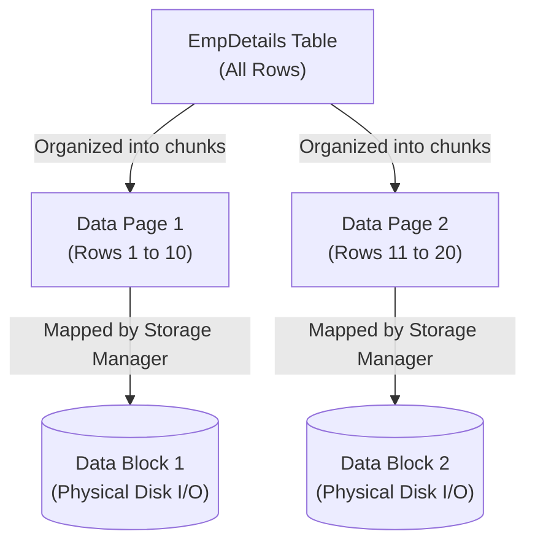
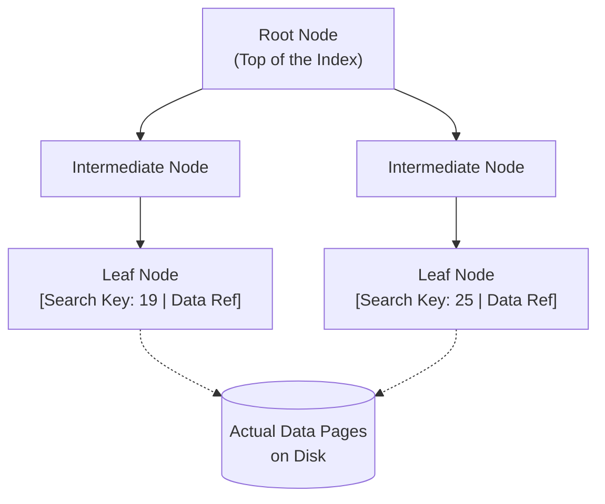
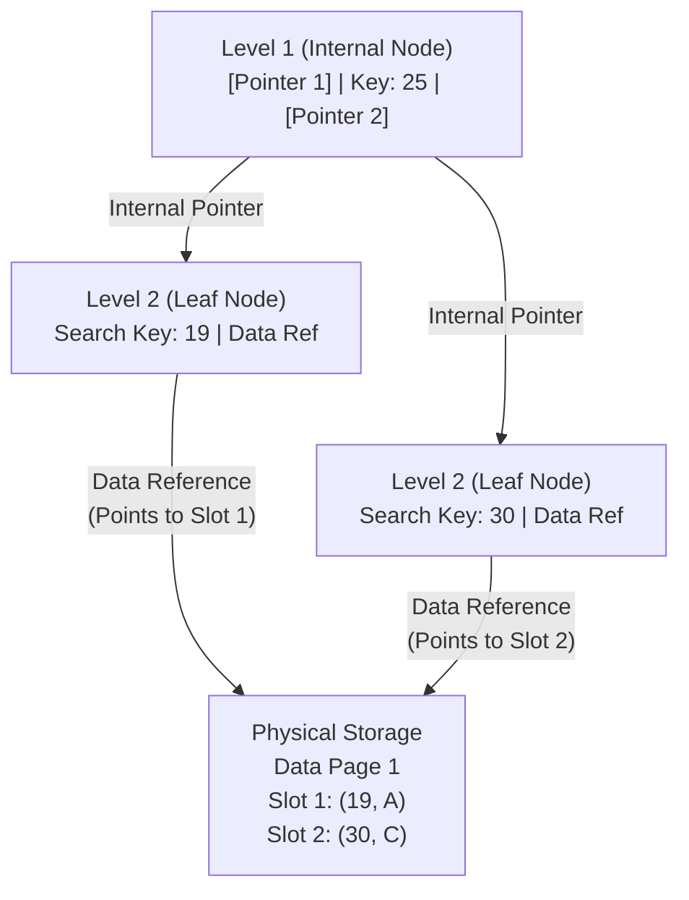
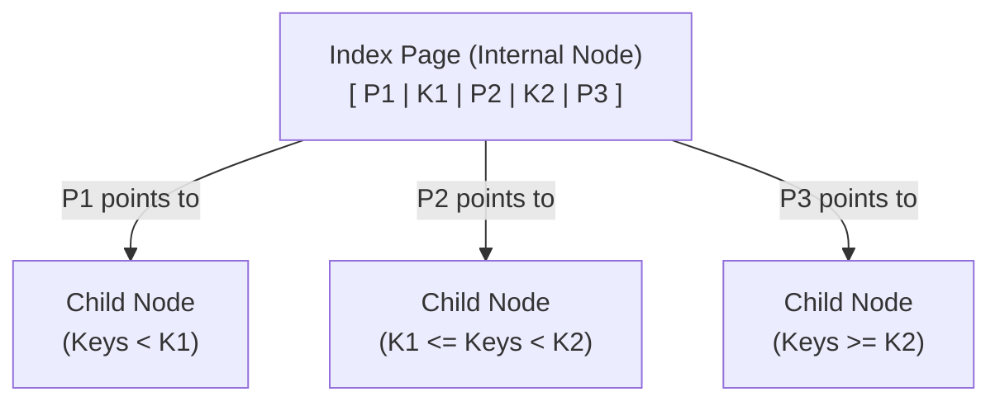

# DBMS Indexing: The Deep Masterclass

Hello there! Imagine we are sitting in a classroom. Today, we are going deeper than surface-level definitions. We are going to build a complete mental model of how a Database Management System (DBMS) stores, manages, and finds data using Indexes and B+ Trees.

By the end of this, you will understand not just the *what*, but the exact *how* and *why*, clearing up every small confusion in all directions.

---

## Part 1: How is Data Actually Stored?

Before we talk about indexing, we must understand the physical reality of your data. 

Suppose we have this simple table:
**EmpDetails:**
| EmpId | EmpName |
|-------|---------|
| 19    | A       |
| 25    | B       |
| 30    | C       |
| 17    | D       |
| 6     | E       |

The database does **not** think of this entire table as one giant object. Instead, it organizes the data into fixed-size units.

### 1. The Data Page (The Logical Container)
A **Data Page** is a fixed-size unit (often around 8 KB) in which database records are actually stored. 

If you could look inside one of these Data Pages, you wouldn't just see raw text. You would see three conceptual parts:
1. **Header:** Contains metadata (like the page number and how much free space is left).
2. **Data Records:** The actual rows of your table.
3. **Offset / Slot Info:** A directory at the end of the page that helps the database instantly locate individual records within that specific page.

### 2. Data Page vs. Data Block (And The Storage Manager)
Here is a major gap that most tutorials completely skip: *Who is managing these pages?*

There are two different worlds:
* **Data Page:** This is the *database's* logical storage unit. This is how the DBMS structures and thinks about data.
* **Data Block:** This is the underlying *physical storage unit* used for physical I/O on your persistent storage (Disk).

Who connects them? **The Storage Manager.**
The Storage Manager is a core component of the DBMS. Its entire job is to handle the mapping between the logical Data Pages and their persistent physical locations (Data Blocks) on the disk.

*(Note: Do not memorize a universal rule like "8 KB page = exactly one physical disk block". The exact implementation differs between database systems, but the Storage Manager always handles this translation).*

### 3. The Nightmare: A Full Table Scan
Imagine a table with 1,000,000 rows. You run:
`SELECT * FROM EmpDetails WHERE EmpId = 500000;`

Without a suitable index, the DBMS asks the Storage Manager to fetch Data Page 1, search it, then Data Page 2, search it, then Data Page 3... 
Searching page after page requires massive physical Disk I/O, which is incredibly expensive. This is the problem we must solve.

---

## Part 2: The Solution (The Index)

To avoid scanning every Data Page, we create an **Index**. 

Indexing means creating an additional structure that helps the DBMS find data faster. Instead of scanning many pages, the flow becomes:
`Query` ➔ `Index` ➔ `Find required location quickly` ➔ `Actual Data`

### What is inside an Index?
At the bottom of an index, you have entries made of two things:
1. **Search Key:** What you are looking for (e.g., `EmpId = 19`).
2. **Data Reference:** A reference that tells the DBMS exactly where the corresponding actual table data can be found. 

**What exactly is a Data Reference?**
It is not just a vague pointer. It is conceptually a combination like `(Data Page Number, Slot Number)`. It tells the Storage Manager: "Go fetch Data Page 1, and look at Slot 3 for this exact record."

### The Concept vs. The Implementation
It is extremely important to remember: **An Index is just a conceptual idea.** The actual physical data structure used to implement this concept in almost all relational databases is the **B+ Tree**.

Here is what the entire B+ Tree index structure looks like:

---

## Part 3: The Gap (Why exactly do we use a B+ Tree?)

If you have millions of rows, your index will have millions of entries (especially if it is a Dense Index). 

If we just saved all these index entries in a simple, flat file (a single-level linear list), the index itself would span thousands of pages. 

> **🙋 Student Question:** *Wait, if the index file is sorted, why can't the database just use Binary Search on the flat file?*
> 
> **👨‍🏫 Teacher's Answer:** That is a brilliant question! Binary search is incredibly fast when data is entirely in your computer's RAM. But remember, this massive index file lives on the slow **Disk**. 
> If you do binary search across 1,000 Index Pages, the DBMS has to fetch Page 500 from the disk, then fetch Page 250, then fetch Page 375... Every "jump" requires a painfully slow physical Disk I/O read. 
> 
> **🙋 Student Follow-up:** *But wait... in a B+ tree, we still have to fetch the Root Page, then the Intermediate Page, then the Leaf Page from the disk. That is still multiple disk reads! What is the difference?*
> 
> **👨‍🏫 Teacher's Answer:** It comes down to the math. It's true both require disk reads, but let's look at *how many*. 
> Imagine one 8KB Index Page can hold 500 pointers. 
> - The Root page holds 500 pointers.
> - The Intermediate level holds 500 × 500 = 250,000 pointers.
> - The Leaf level holds 500 × 250,000 = **125,000,000** records.
> To find one record out of 125 million using a B+ Tree, you only need **3 disk reads** (Root ➔ Intermediate ➔ Leaf). 
> If you used Binary Search on a flat file of 125 million records, you would need `log2(125,000,000)` = **27 disk reads**. 
> Furthermore, databases are smart: they keep the Root and Intermediate pages cached in the fast RAM because they are used for almost every query. So in reality, searching a 125-million row B+ Tree often requires only **1** actual physical disk read (fetching the leaf)!

To organize this massive list so it can be searched with the absolute minimum number of disk reads, we break it down into multiple levels (a Multi-Level Index) using the **B+ Tree** shown above.
Why a B+ Tree?
* The tree remains perfectly balanced.
* Millions of values only result in a tree a few levels deep.
* Insertions, deletions, and searches are extremely efficient (logarithmic time).

### The Most Important Distinction (Do Not Confuse These!)
A B+ Tree has two types of nodes. You *must* understand what their pointers do. This is the distinction that usually causes confusion:

1. **INTERNAL NODE POINTERS ➔ Point to another INDEX PAGE / B+ Tree Node.**
   * Internal nodes are just guideposts (e.g., "If Key < 25, go left"). They do not point to your table data.
2. **LEAF NODE DATA REFERENCES ➔ Point to the ACTUAL DATA RECORD.**
   * Leaves hold the `(Page Number, Slot Number)` that tells the Storage Manager where to fetch the actual table row.

Here is a visual breakdown showing exactly how these two types of pointers behave differently:

### Where are the B+ Tree Nodes stored?
A B+ Tree is huge, so it cannot be stored as one single physical object. It must also be saved to the disk. 
Just like table data is stored in *Data Pages*, the nodes of the B+ Tree are stored in **Index Pages**.

* Root Node ➔ Stored in Index Page 1
* Internal Node ➔ Stored in Index Page 2
* Leaf Node ➔ Stored in Index Page 3

To visualize exactly what one of these internal nodes looks like when saved inside an Index Page, think of it as an alternating array of Pointers (P) and Keys (K):

**Rule of Thumb:**
* **Index Pages** store the B+ Tree information.
* **Data Pages** store the actual table records.

---

