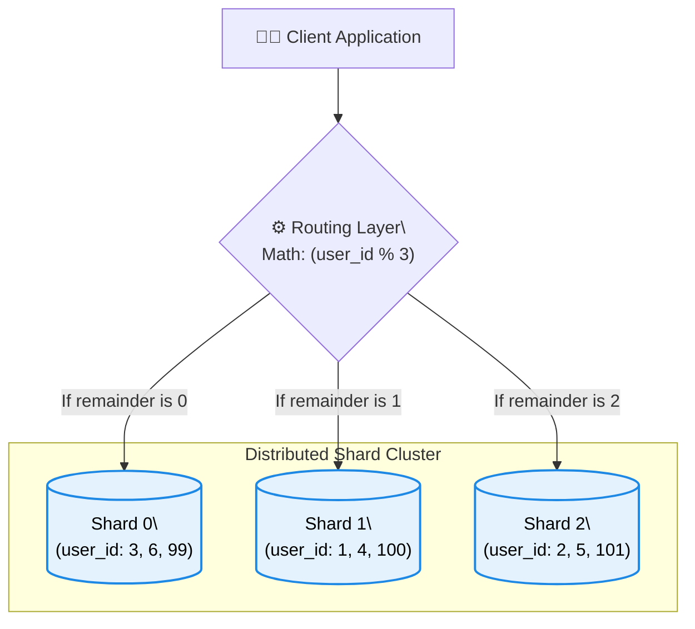
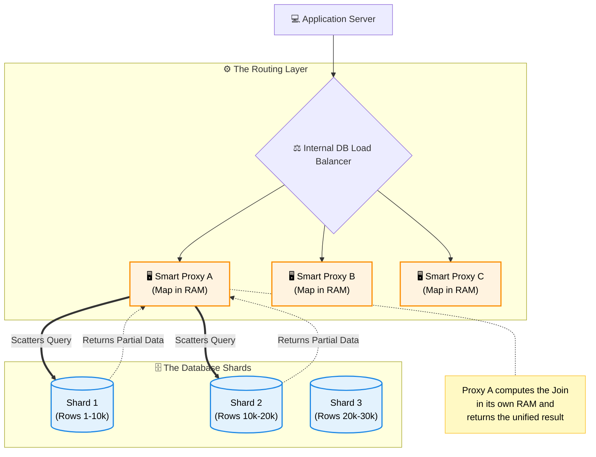
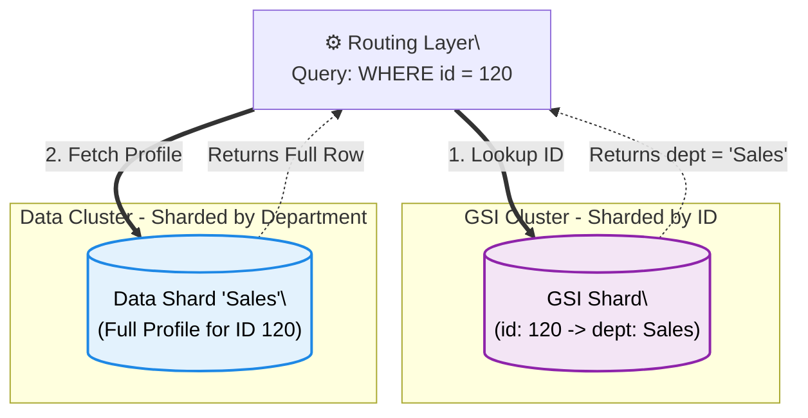

# DBMS Architecture: Partitioning, Sharding & Distributed Systems

Welcome to the masterclass on database partitioning and sharding. This guide will walk you through how to break down massive databases to achieve infinite scale, and how to solve the distributed engineering problems that arise when you do.

## ⭐ Part 1: What is Partitioning?

<b>📖 Click to read this section</b>

Imagine you have a massive, incredibly heavy textbook. Instead of carrying the entire book just to read one specific chapter, you separate it into smaller, individual booklets. 

That is exactly what **Partitioning** is. It is the technique of breaking a large database table into smaller, manageable slices of data. 

**Crucially:** If we break the table and all of those smaller slices still reside on a *single physical machine*, it is called normal **Partitioning**. However, if those slices are spread over *multiple different servers*, then it is called **Sharding**. 

### When Do We Apply Partitioning?
You don't need to partition every database. We introduce this technique under two specific conditions:
1. **The Dataset is Too Huge:** The sheer volume of data makes backups, indexing, and basic management too tedious and slow.
2. **The Traffic is Too Heavy:** The number of requests hitting the database is so large that a single server's CPU queues up, causing the system's response time to spike.

### The Advantages of Partitioning
* **Performance & Parallelism:** Multiple read/write operations can happen simultaneously across different partitions.
* **Availability:** If one partition is corrupted or goes down, the rest of the database remains accessible.
* **Manageability:** Smaller chunks of data are vastly easier to backup, restore, and maintain.
* **Cost Reduction:** Partitioning reduces the load on a single machine, potentially delaying or avoiding expensive hardware upgrades.

## ⭐ Part 2: Vertical vs Horizontal Partitioning

<b>📖 Click to read this section</b>

Depending on how your data is accessed, there are two primary ways to slice a database table.

### 1. Vertical Partitioning (Slicing by Columns)
This involves slicing the data relation vertically. 
* Imagine a `Users` table with 50 columns. You might put the `id`, `name`, and `email` on Partition A (accessed frequently for login), and the `bio`, `profile_picture`, and `address` on Partition B (accessed rarely).
* **The Catch:** Because the columns of a single record are split up, the application must join data from different partitions to put a complete row back together.

### 2. Horizontal Partitioning (Slicing by Rows)
This involves slicing the data relation horizontally. 
* In this method, independent chunks of *complete* data rows (tuples) are stored in different partitions. For example, Users A-M go into Partition A, and Users N-Z go into Partition B.
* The structure of the table remains identical across all partitions; only the raw rows are divided.

## ⭐ Part 3: What is Sharding? (Distributed Horizontal Partitioning)

<b>📖 Click to read this section</b>

As established in Part 1, standard partitioning is limited by the size of a single physical computer. Eventually, your database grows so massive that no single computer in the world has enough hard drive space or CPU power to hold it. 

This is where **Sharding** comes in.

### What is Sharding?
Sharding is a distinct distributed architecture where you split a massive database across **multiple completely different physical computers**. It borrows the idea of horizontal slicing, but instead of keeping the data on one machine, it distributes it across a network.

### Core Concepts: Shards, Shard IDs, and Shard Keys
* **A Shard:** Each of these independent physical computers—holding its own specific slice of the overall data—is called a **Shard**. Each Shard is an actual, fully-functioning database server sitting in a data center.
* **A Shard ID:** Because the data is spread across many computers, the system assigns a unique physical identifier (like `Shard 0`, `Shard 1`, `Shard 2`) to each machine. This **Shard ID** acts like a street address, telling the network exactly which computer to send the query to.
* **A Shard Key:** This is the specific column in your database table (such as `user_id` or `email`) that the system uses to determine where a row should live. The system looks at the Shard Key to calculate the final Shard ID.

While they are separate computers, your application seamlessly treats them all together as one giant, logical database. 

### The Routing Layer & The Math
Because the data is spread out, the application cannot just send a query randomly. You must introduce a **Routing Layer**. 

When a request comes in, the router runs a deterministic math formula—a **Hash Function**—directly on the **Shard Key**. 
For example, if the Shard Key is `user_id`, the math might be: `user_id % 3`. 
If `user_id = 99`, then `99 % 3 = 0`. The router now guarantees with 100% mathematical certainty that User 99 lives on Shard 0.

## Part 4: The Routing Layer Deep Dive (Smart Proxies)

<b>📖 Click to read this section</b>

In enterprise systems, the Routing Layer is not just a simple mathematical formula hidden in the application code. It is a highly complex, dedicated infrastructure tier made up of **Database Proxy Servers** (like Vitess or ProxySQL).

### How the Real-World Routing Layer Works
* **The Internal Load Balancer:** Just like application servers, a single routing proxy would crash under massive traffic. To handle millions of database requests, we need **many** proxy servers running simultaneously. Because we have a large group of proxies, an internal Database Load Balancer is placed in front of them to distribute the incoming queries evenly across the entire fleet.
* **Stateless & RAM-Based Mapping:** Proxy servers do not store any actual database rows. They are entirely *stateless*. They only hold the **Mapping Dictionary** (the rules of which Shard holds what data) loaded directly into their fast RAM.
* **Fault Tolerance:** Because proxies are stateless, if one crashes, the Load Balancer instantly detects it and routes traffic to the surviving proxies. No data is lost, and a new proxy can be booted up in seconds.
* **In-Memory Operations:** The most powerful feature of a Smart Proxy is how it handles cross-shard queries. If you request data that spans across multiple shards, the proxy scatters the queries, pulls the partial data from the shards into its *own* RAM, mathematically merges/joins the data together, and returns a single, unified response to the application.

## Part 5: Challenge 1 - The Scatter-Gather Problem

<b>📖 Click to read this section</b>

While sharding provides massive scale, it introduces complex distributed networking problems.

### The Problem
If your database is sharded by `department_id`, and you run `SELECT * FROM employee WHERE id = 120`, the Routing Layer has a crisis. Because you didn't provide the `department_id` (the shard key), the router has no math to run. 
It is forced to **Scatter** the query to every single shard, wait for all of them to search their hard drives, and **Gather** the results. This consumes massive network bandwidth and destroys the performance benefits of sharding.

### The Solution: Global Secondary Indexes (GSI)
If you frequently query by a non-shard key (like `id`), you create a GSI. A GSI is a separate, specialized table that maps the `id` to the actual Shard location.

**How does a GSI not crash from being too big?**
1. **It's a Skinny Table:** A GSI only holds two columns: `[Search_Key, Location_Pointer]`. Millions of these skinny rows fit easily in ultra-fast RAM.
2. **The GSI is also Sharded:** We don't put the GSI on one machine; we shard the index itself based on the `id`.

### The Trade-off (The Double Hop)
Using a GSI avoids the Scatter-Gather disaster, but it forces a network double-hop. You trade raw local speed for infinite, reliable scale.

## Part 6: Challenge 2 - Data Skew & Hotspots

<b>📖 Click to read this section</b>

### The Celebrity Problem
Imagine you shard a social media database alphabetically by username. The shard holding users 'A' to 'C' happens to contain a massive global celebrity. Whenever that celebrity posts, millions of users query that single shard. 
That one server crashes from overload (a **Hotspot**), while the other shards sit completely idle.

### The Solutions
1. **Consistent Hashing:** Instead of alphabetical sharding, we run the shard key through a cryptographic hash function (like MD5). This scrambles the inputs, distributing the data purely randomly and evenly across all servers.
2. **Compound Shard Keys:** What if the celebrity is just one user and still crashes the server? We combine attributes: `username + month_year`. 
   * Posts from January go to Server A.
   * Posts from February go to Server B.
   * By partitioning *time*, we force new traffic to hit a different server each month, protecting historical servers from current viral traffic. When users scroll down, the app paginates and asks for highly specific time-buckets, preventing Scatter-Gather.

## Part 7: Challenge 3 - The Distributed Join

<b>📖 Click to read this section</b>

In a single database, joining an `Orders` table with a `Users` table is instant. But in a sharded system, User A lives on Server 1, and User A's Orders live on Server 4. Pulling gigabytes of data across the network to join them is incredibly slow.

### Solution A: Data Locality (Co-location)
We purposefully design the system so related data shares the **exact same shard key** (e.g., `user_id`). 

Because the Router uses deterministic math (e.g., `user_id % 3`), it doesn't care what table the data belongs to. 
* If Alice (`user_id = 99`) is saved in the Users table: `99 % 3 = 0` -> **Server 0**.
* If Alice buys a phone in the Orders table (`user_id = 99`): `99 % 3 = 0` -> **Server 0**.

The math guarantees all of Alice's related data lands on the exact same physical hard drive. The join can now happen locally on Server 0 with zero network lag!

### Solution B: Denormalization
We stop joining entirely. Instead of keeping a separate `Address` table, we duplicate the address text directly inside the `Orders` table. It wastes some disk space, but disk space is cheap compared to slow network calls.

## Part 8: Challenge 4 - Distributed Transactions

<b>📖 Click to read this section</b>

Imagine transferring $100 from Alice (Server 1) to Bob (Server 2). The system deducts $100 from Alice, but right before adding it to Bob, Server 2 crashes. Keeping data perfectly consistent across machines during failures is the hardest problem in distributed systems.

### Solution A: Two-Phase Commit (2PC)
A central coordinator acts as a referee. It asks Server 1 and Server 2 to "prepare" and lock their data. Only when *both* servers confirm they are 100% ready and error-free does the coordinator send the final "commit" command. If anyone hesitates, it aborts.

### Solution B: The Saga Pattern
Heavily used in modern microservices. It breaks the transaction into local steps. 
* Step 1: Deduct Alice (Success! Send message to Step 2).
* Step 2: Add to Bob (Fails!).
* If Step 2 fails, the system automatically runs a "Compensating Transaction"—a programmatic undo—to refund Alice's account, reversing the work step-by-step.

