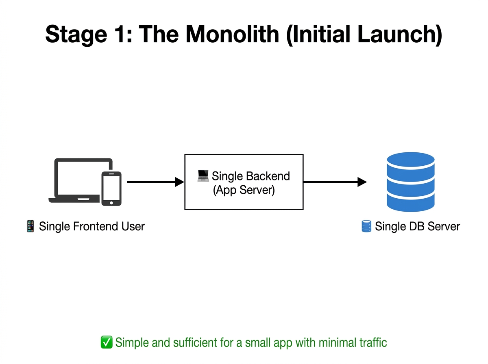
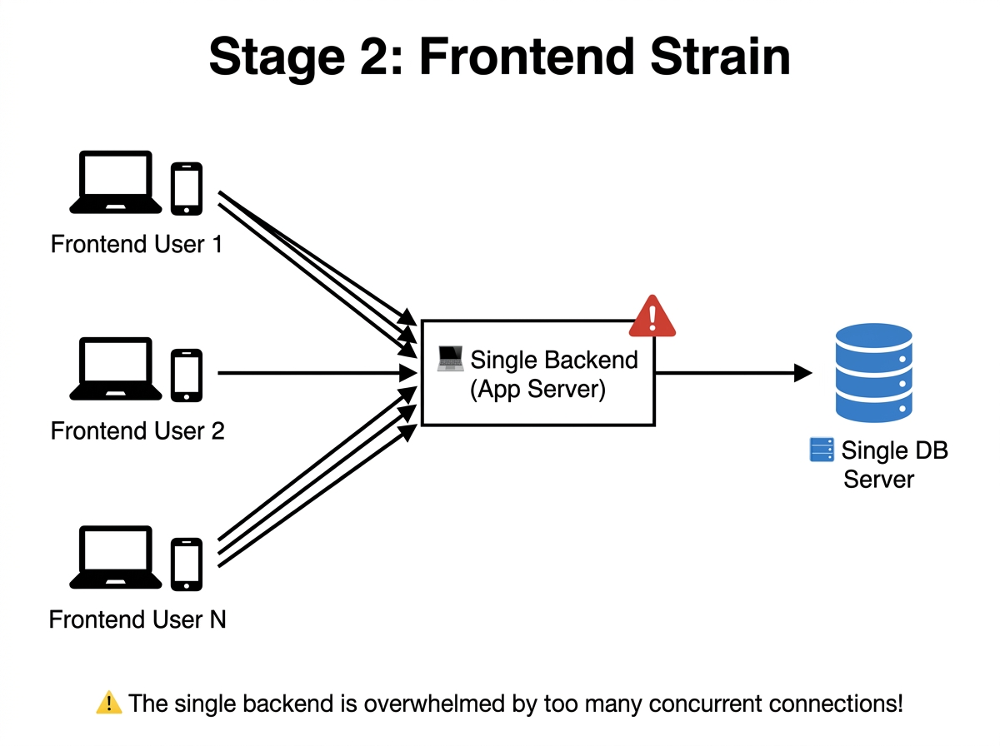
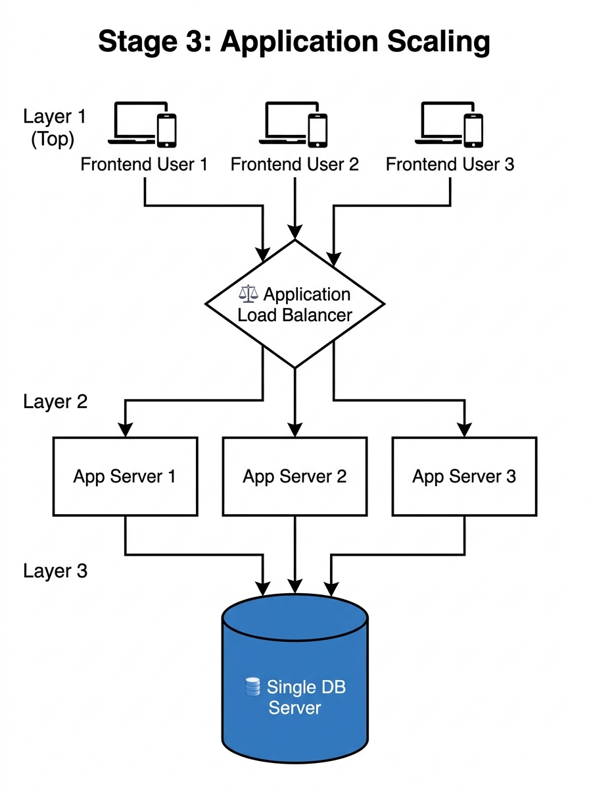
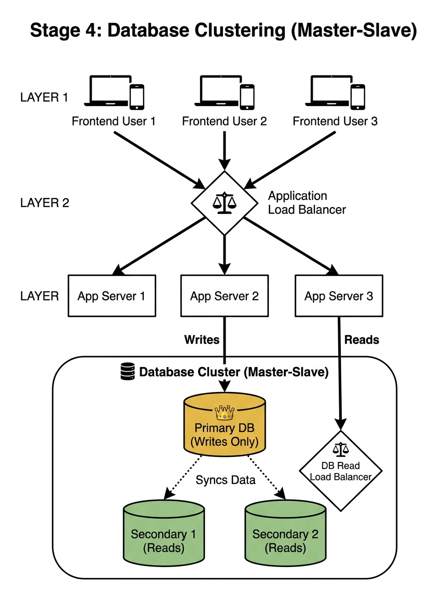
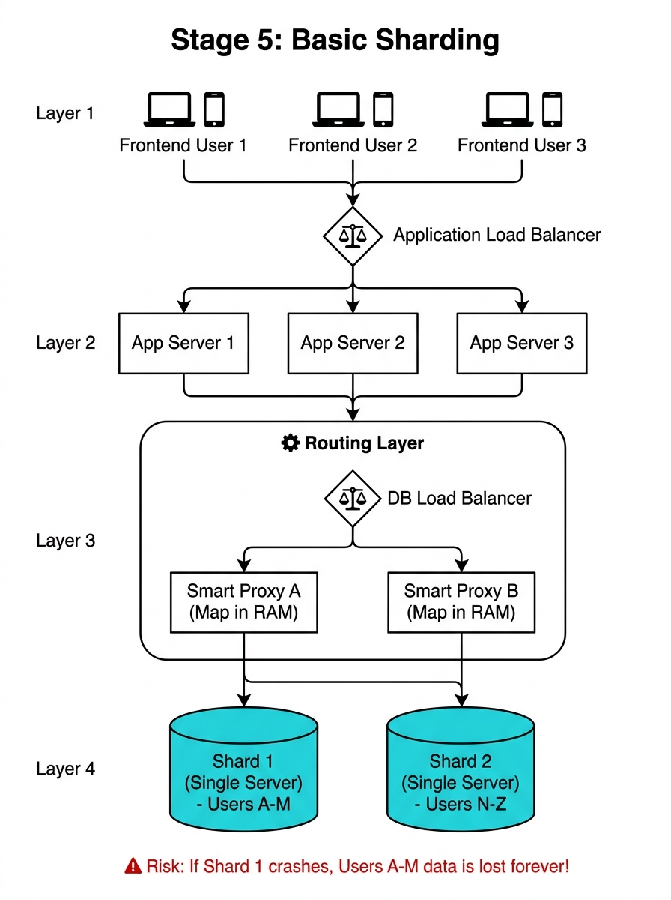
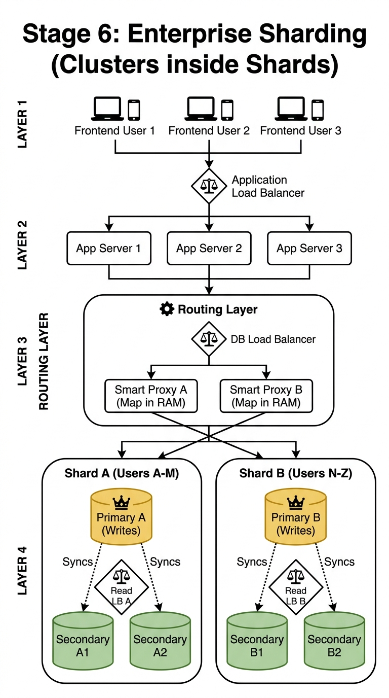
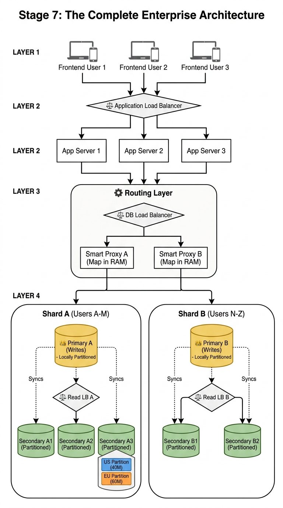

# DBMS Architecture: The Evolution of System Design

As a product grows from a tiny startup to a global enterprise, the underlying architecture must evolve to handle the increasing data, traffic, and complexity. 
Below are the 7 distinct stages of system evolution, detailing exactly what components are added to prevent the system from crashing under scale.

---

## Stage 1: The Monolith (Initial Launch)

<b>📖 Click to read this section</b>

* **The Scenario:** The application has just launched. There are very few users and minimal traffic.
* **The Architecture:** The simplest possible setup:
  * A single frontend client (browser/app) sends requests to a single backend application server.
  * That backend server reads and writes to a single database server.
* **Why this works:** At this stage, one machine can easily handle all the traffic. There is no need for any complex architecture. Simple, cheap, and fast to develop.

## Stage 2: Frontend Strain (The Vertical Scaling Ceiling)

<b>📖 Click to read this section</b>

* **The Scenario:** The app is gaining popularity. Hundreds of users are now making requests at the same time.
* **The Problem:** The single backend server is overwhelmed by the sheer number of concurrent connections. Requests start queuing up, and response times spike. The database is still fine — the bottleneck is purely the backend server's CPU and RAM.
* **The First Instinct — Vertical Scaling:** The easiest fix is to upgrade the existing server — buy more RAM, a faster CPU, bigger SSD. This is called **Vertical Scaling** (scaling *up*).
* **Why Vertical Scaling Fails:**
  * There is a **physical ceiling** — you cannot add infinite RAM or CPU to a single machine. Hardware has limits.
  * It is **astronomically expensive** — a server with 2x the power costs far more than 2x the price.
  * It creates a **Single Point of Failure** — if this one powerful server crashes, the entire application goes down.

> This is the moment we are forced to think differently: instead of making one machine bigger, we add *more* machines.

## Stage 3: Application Scaling (Horizontal Scaling)

<b>📖 Click to read this section</b>

* **The Scenario:** Vertical scaling has hit its limit. We need to handle thousands of concurrent users.
* **The Solution — Horizontal Scaling:** Instead of buying one bigger server, we buy *multiple* cheaper servers and split the traffic between them. This is called **Horizontal Scaling** (scaling *out*).
* **What we introduce:**
  * **Application Load Balancer:** A dedicated component that sits in front of all the app servers. Every frontend request first hits the Load Balancer, which intelligently distributes requests across the available App Servers.
  * **Multiple Application Servers:** Each server handles a portion of the incoming traffic. If one server crashes, the Load Balancer simply stops sending traffic to it — the other servers keep running.
* **The Database:** Still a single server. The data volume is manageable, so there is no need to complicate the database layer yet.

## Stage 4: Database Clustering (Master-Slave Architecture)

<b>📖 Click to read this section</b>

* **The Scenario:** The application layer is now horizontally scaled and handling traffic perfectly. But the single database server is now the bottleneck — it is being crushed by millions of read requests.
* **Key Insight:** In most applications, **reads vastly outnumber writes** (e.g., 1000 users reading profiles for every 1 user updating theirs).
* **The Solution — Database Clustering (Replica Set):**
  * **Primary Node (Master):** The *only* node that accepts write operations. All new data goes here first.
  * **Secondary Nodes (Slaves):** These maintain an exact copy of the Primary's data through replication (sync). They handle *all* the read requests.
  * **Internal Read Load Balancer:** Because there are multiple Secondary nodes, we add a Read Load Balancer to distribute read queries evenly among them.
* **The Result:** Writes go directly to the Primary. Reads are distributed across multiple Secondaries. The database can now handle massive read traffic without breaking a sweat.

## Stage 5: Basic Sharding

<b>📖 Click to read this section</b>

* **The Scenario:** The user base has exploded. The data volume is now so massive that **no single machine's hard drive can physically store all the data**. Even the powerful Primary node is running out of disk space and CPU power.
* **The Solution — Sharding:** We split the data itself across multiple independent servers. Each server holds only a *slice* of the total data (e.g., Users A-M on Shard 1, Users N-Z on Shard 2).
* **What we introduce:**
  * **The Routing Layer:** Since the data is spread across multiple servers, the application can't just query randomly. We introduce a dedicated Routing Layer made of:
    * **DB Load Balancer:** Distributes incoming database queries across multiple Smart Proxy servers.
    * **Smart Proxy Servers:** Each proxy holds a **mapping dictionary in RAM** (which shard holds what data). It reads the query, runs the hash function on the shard key, and routes the query to the exact correct shard.
  * **Shards (Single Servers):** At this stage, each shard is just a single physical server holding its slice of data.
* **⚠️ The Risk:** If Shard 1's single server crashes, all of Users A-M's data is **permanently lost**. There is no backup!

## Stage 6: Enterprise Sharding (Clusters inside Shards)

<b>📖 Click to read this section</b>

* **The Scenario:** Sharding solved the storage limits, but if Shard 1's single server crashes, half of our users' data is gone forever. We need fault tolerance.
* **The Solution — Combine Sharding + Clustering:** We make **each individual Shard its own Master-Slave Cluster**. Now every shard has:
  * A **Primary Node** that handles writes for that shard's data slice.
  * Multiple **Secondary Nodes** that hold replicas of the same data and handle reads.
  * An **Internal Read Load Balancer** to distribute reads among the Secondaries.
* **The Result:**
  * **Infinite Scale:** Data is distributed across shards (horizontal scaling).
  * **Fault Tolerance:** If one server inside Shard A crashes, the other replicas still have the data. No data is lost.
  * **High Read Throughput:** Each shard's internal Read LB distributes the read load across its Secondaries.

## Stage 7: Macro-Sharding + Micro-Partitioning (The Final Boss)

<b>📖 Click to read this section</b>

* **The Scenario:** The Routing Layer successfully routes the query to the correct Shard. But that Shard holds 100 Million rows. If the user asks for US data (40M rows), the server's CPU still has to scan all 100M rows on its hard drive to find the relevant 40M.
* **The Ultimate Solution — Layer two optimizations together:**
  * **Macro Level (Sharding):** Distributes the data across different physical machines over the network.
  * **Micro Level (Local Partitioning):** Inside *every single node* (Primary and all Secondaries) of the Shard, the database engine further splits the data on disk by a column like `region`.
* **How it works in practice:**
  * A query for "US users" arrives at Shard A.
  * The local database engine checks its internal metadata and sees the table is partitioned by region.
  * It instantly **skips** the EU partition file (60M rows) — a process called **Partition Pruning**.
  * It **only scans** the US partition file (40M rows), saving massive CPU and Disk I/O time.
* **The Result:** Network-level optimization (sharding) + Disk-level optimization (partitioning) = the fastest possible query execution at global scale.

